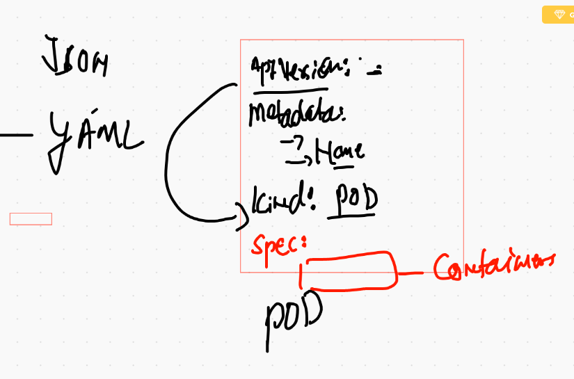

# Application deployment using K8s

## k8s deploy container images by creating Pod 


## Pod more close 


## checking minikube based k8s cluster status 

```
❯ kubectl  get  no
NAME           STATUS   ROLES                  AGE   VERSION
minikube       Ready    control-plane,master   17h   v1.20.2
minikube-m02   Ready    <none>                 24m   v1.20.2
❯ kubectl  get  nodes
NAME           STATUS   ROLES                  AGE   VERSION
minikube       Ready    control-plane,master   17h   v1.20.2
minikube-m02   Ready    <none>                 24m   v1.20.2
❯ 
❯ kubectl  get  pods
No resources found in default namespace.

```

## Pod Design format 



## FIrst pod design

```
apiVersion: v1
kind: Pod
metadata:
 name: ashu-pod-1 # name of my pod
spec: # info about application
 containers:
 - image: nginx # image from docker hub 
   name: ashuc1 # name of container 
   ports: # default port of application 
   - containerPort: 80
   
```

## checking syntax 

```
❯ kubectl  apply -f ashupod1.yaml --dry-run=client
pod/ashu-pod-1 created (dry run)

```
## deploying pod 

```
❯ kubectl  apply -f ashupod1.yaml
pod/ashu-pod-1 created
❯ kubectl get po
NAME         READY   STATUS              RESTARTS   AGE
ashu-pod-1   0/1     ContainerCreating   0          15s
❯ kubectl get po
NAME         READY   STATUS    RESTARTS   AGE
ashu-pod-1   1/1     Running   0          36s
❯ kubectl get pod
NAME         READY   STATUS    RESTARTS   AGE
ashu-pod-1   1/1     Running   0          38s

```


