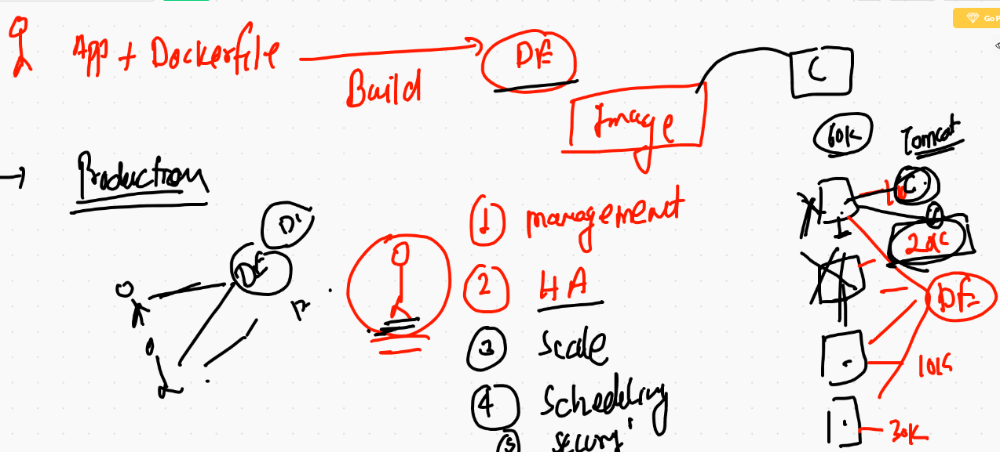
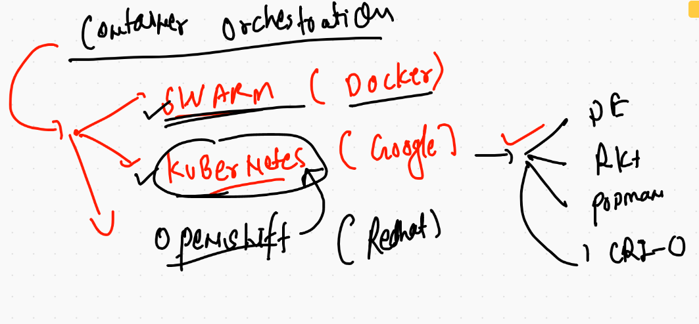
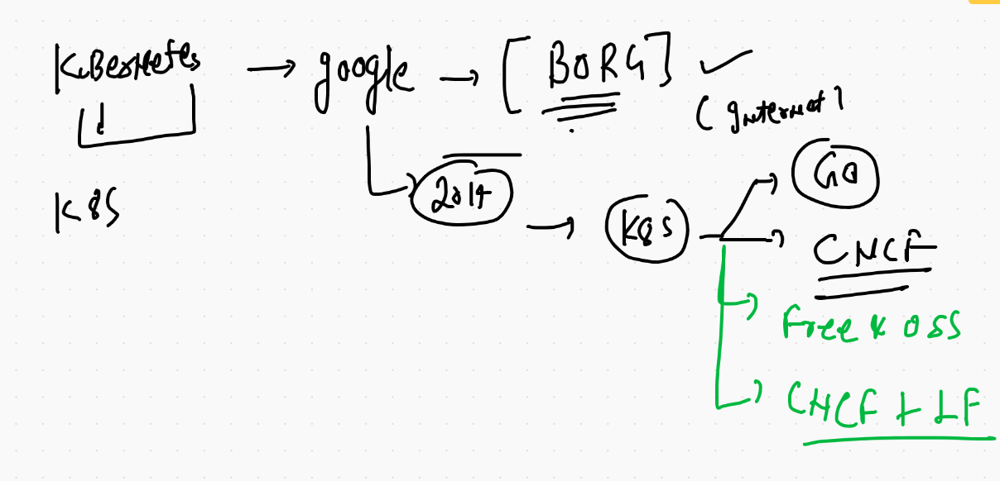
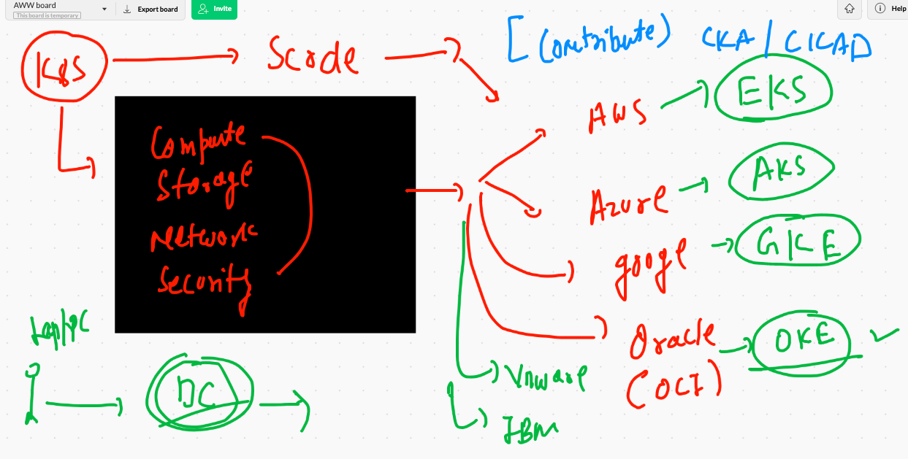
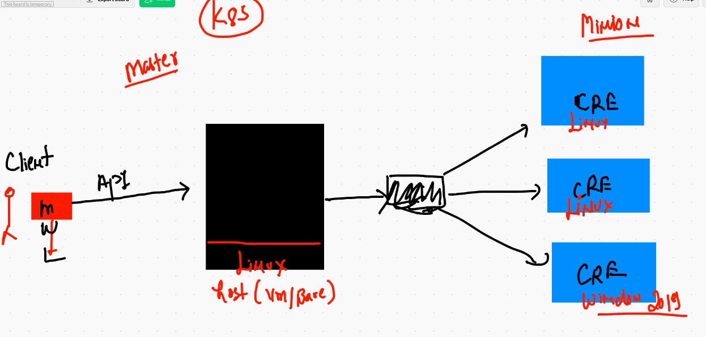
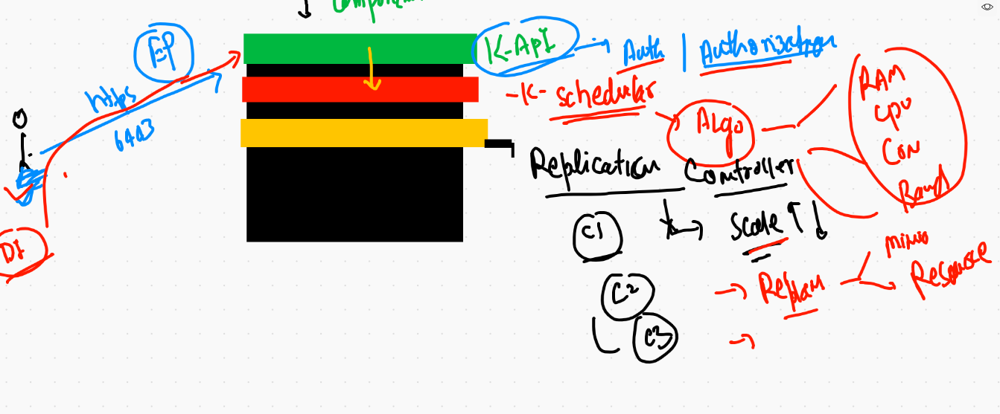
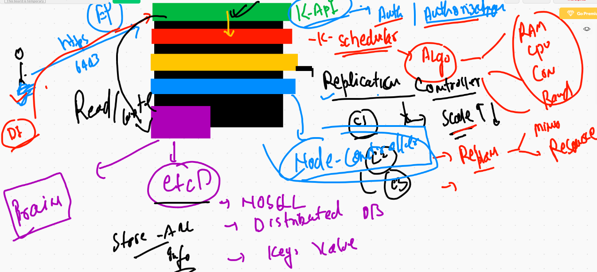
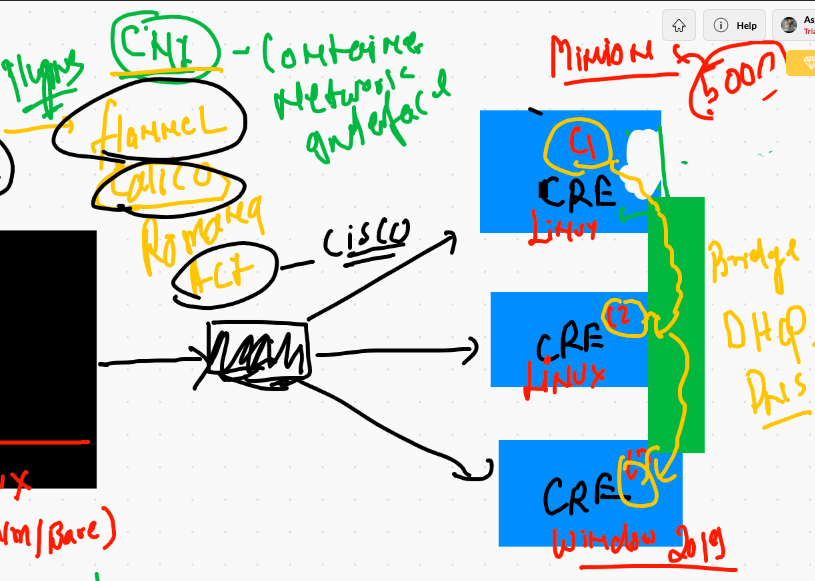
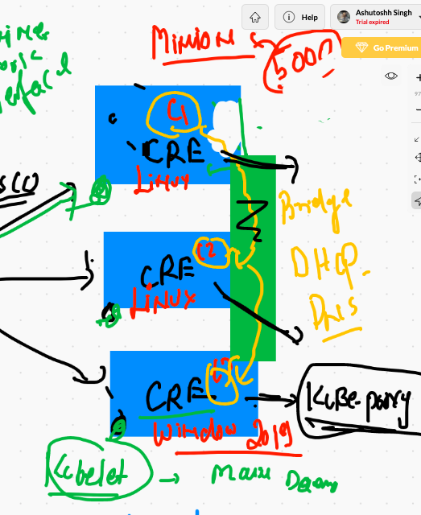
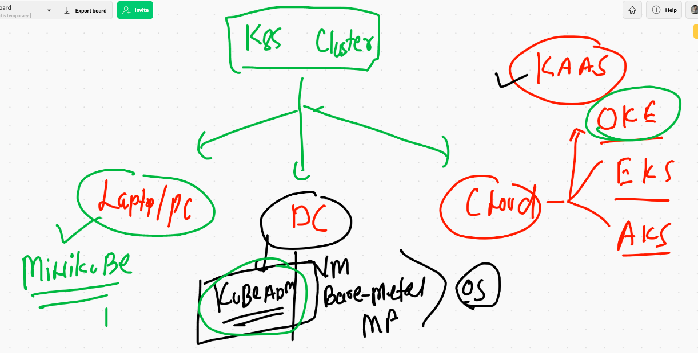

# Container based application problems



## COntainer orchestration engines 



## kubernetes 



## kubernetes deployment / services offering 



## Simplest arch of k8s (L1)



##  k8s Master node components (L2)



## All required master node components. (L3)





# Mininode Discussion 

## CNI (Container network interface)

[CNI](https://github.com/containernetworking/cni)

## Minion Node CNI [L1]



## Minion Node [kubelet & kube-proxy ]




# K8s cluster setup options 



## INstalling minikube on Mac 

```
❯ curl -LO https://storage.googleapis.com/minikube/releases/latest/minikube-darwin-amd64
sudo install minikube-darwin-amd64 /usr/local/bin/minikube

  % Total    % Received % Xferd  Average Speed   Time    Time     Time  Current
                                 Dload  Upload   Total   Spent    Left  Speed
100 52.6M  100 52.6M    0     0  6200k      0  0:00:08  0:00:08 --:--:-- 7690k
Password:
❯ minikube version
minikube version: v1.17.1
commit: 043bdca07e54ab6e4fc0457e3064048f34133d7e


```

## MInikube download & install link 

[minikube](https://minikube.sigs.k8s.io/docs/start/)


## k8s cluster using minikube as docker driver 

```
❯ minikube start  --driver=docker
😄  minikube v1.17.1 on Darwin 11.2
✨  Using the docker driver based on user configuration
👍  Starting control plane node minikube in cluster minikube
🔥  Creating docker container (CPUs=2, Memory=1990MB) ...
🐳  Preparing Kubernetes v1.20.2 on Docker 20.10.2 ...
    ▪ Generating certificates and keys ...
    ▪ Booting up control plane ...
    ▪ Configuring RBAC rules ...
🔎  Verifying Kubernetes components...
🌟  Enabled addons: storage-provisioner, default-storageclass
🏄  Done! kubectl is now configured to use "minikube" cluster and "default" namespace by default

```

## cluster status 

```
❯ minikube status
minikube
type: Control Plane
host: Running
kubelet: Running
apiserver: Running
kubeconfig: Configured
timeToStop: Nonexistent

```


