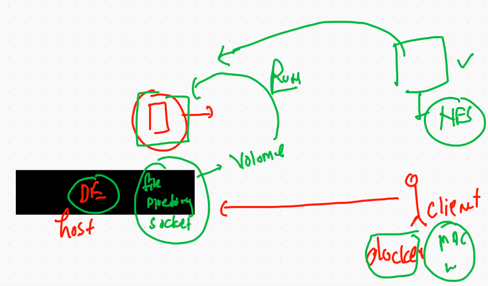
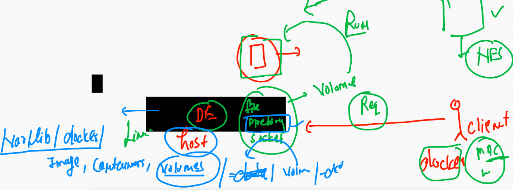

# REcap


# Docker volume 

## Volume concepts 



## creating volume 

```
docker volume  create  ashuvol123 

```

## checking storage location to Docker engine side

```
❯ docker volume  inspect  ashuvol123
[
    {
        "CreatedAt": "2021-02-03T04:25:45Z",
        "Driver": "local",
        "Labels": {},
        "Mountpoint": "/var/lib/docker/volumes/ashuvol123/_data",
        "Name": "ashuvol123",
        "Options": {},
        "Scope": "local"
    }
]

```

## a closure look to volume 



## Mysql Db 

```
 docker  run  -d  --name ashudb -e  MYSQL_ROOT_PASSWORD=mypass  -v ashuvol123:/var/lib/mysql  mysql 
 
```

## A directory as volume in Readonly permission 

```
❯ docker  run -it  --name x1 -v  /etc:/myetc:ro   alpine  sh
/ # cd  /myetc/
/myetc # ls
afpovertcp.cfg                         localtime                              postfix
aliases                                locate.rc                              ppp
aliases.db                             mail.rc                                profile
apache2                                man.conf                               protocols
asl                                    manpaths                               racoon
asl.conf                               manpaths.d                             rc.common
auto_home                   

```

## sharing 

```
docker  run -it  --name x2 -v  /etc:/myetc:ro -v /opt:/xyz:rw   alpine  sh 

```
## sharing file as volume 

```
docker  run -it  --name x11 -v  /etc/passwd:/hello.txt    alpine  sh
```

## portainer deployment 

```
docker  run  -d --name ashuwebui -p 1100:9000 -v /var/run/docker.sock:/var/run/docker.sock portainer/portainer
```

