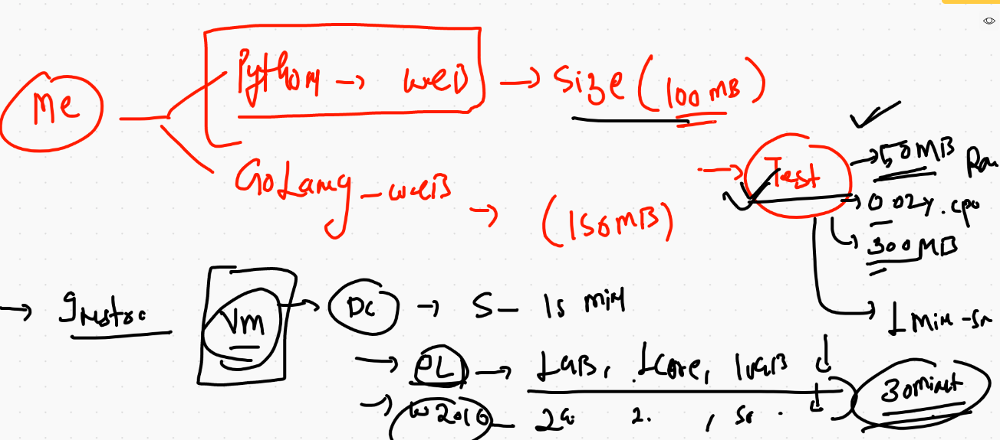
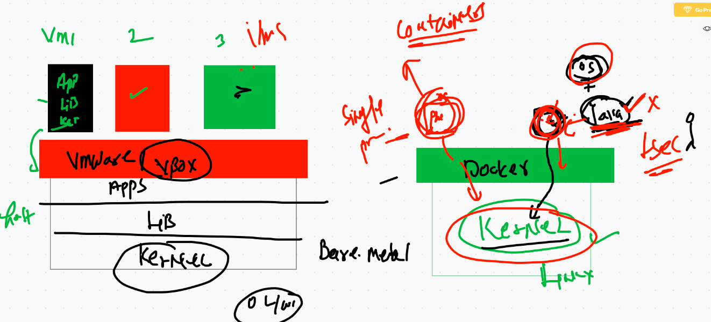
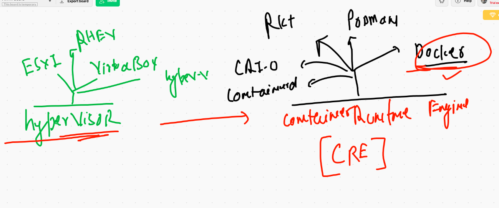
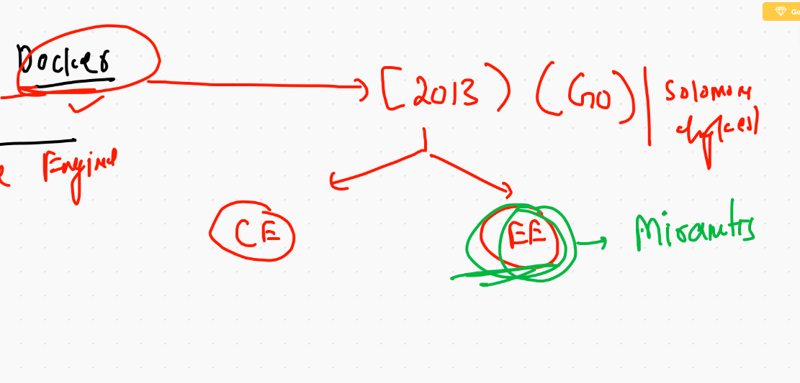
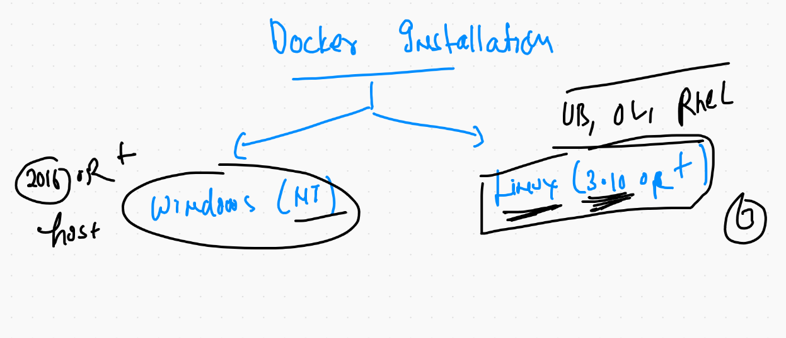
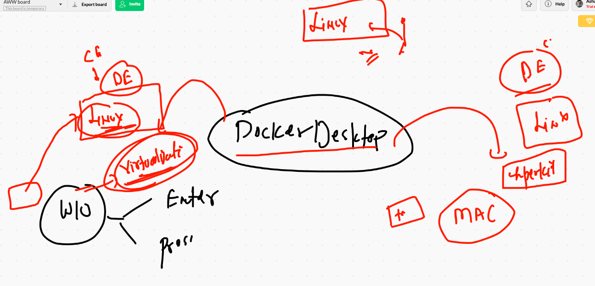
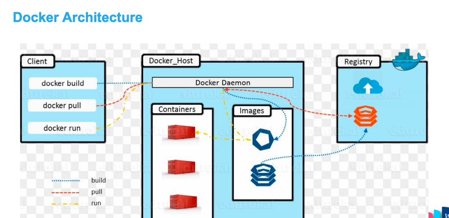
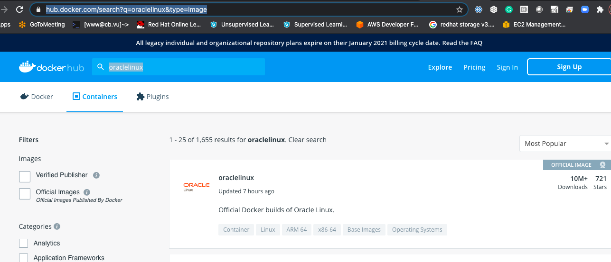

# Docker getting started 

## pre-requiste 


## journey  from Bare-metal to Containers 


## vm problems case 1 



## vms vs containers




# CRE 



## More Info about Docker 




## Docker instation 



## Docker desktop 



## Docker ce. installation on LInux based OS 

```
    4  yum  install docker -y
    5  systemctl enable --now docker 
    6  history 
[root@ip-172-31-32-255 ~]# systemctl status docker 
● docker.service - Docker Application Container Engine
   Loaded: loaded (/usr/lib/systemd/system/docker.service; enabled; vendor preset: disabled)
   Active: active (running) since Mon 2021-02-01 06:25:31 UTC; 9s ago
     Docs: https://docs.docker.com
  Process: 3705 ExecStartPre=/usr/libexec/docker/docker-setup-runtimes.sh (code=exited, status=0/SUCCESS)
  Process: 3691 ExecStartPre=/bin/mkdir -p /run/docker (code=exited, status=0/SUCCESS)
 Main PID: 3714 (dockerd)

```

## Link for installation 

['docker docs'] ('https://docs.docker.com/engine/install/centos/')


## Getting started with containers 

## architecture 




## Image registry 

## docker hub 




## Docker client sending instruction to docker engine 

## searching image on docker hub 

```
5180  docker  search  java 
 5181  docker  search   python 
 5182  docker  search   dockerashu
 5183  docker  search   ashutoshh
 
```

## checking image on docker engine 


```
[root@ip-172-31-32-255 ~]# docker  images
REPOSITORY          TAG                 IMAGE ID            CREATED             SIZE
[root@ip-172-31-32-255 ~]# 

```


## pull image 

```
[root@ip-172-31-32-255 ~]# docker  pull  java 
Using default tag: latest
latest: Pulling from library/java
5040bd298390: Pull complete 
fce5728aad85: Pull complete 
76610ec20bf5: Pull complete 
60170fec2151: Pull complete 
e98f73de8f0d: Pull complete 
11f7af24ed9c: Pull complete 
49e2d6393f32: Pull complete 
bb9cdec9c7f3: Pull complete 
Digest: sha256:c1ff613e8ba25833d2e1940da0940c3824f03f802c449f3d1815a66b7f8c0e9d
Status: Downloaded newer image for java:latest
docker.io/library/java:latest
[root@ip-172-31-32-255 ~]# 
[root@ip-172-31-32-255 ~]# docker  images
REPOSITORY          TAG                 IMAGE ID            CREATED             SIZE
java                latest              d23bdf5b1b1b        4 years ago         643MB

```

## pulling more images 

```
[root@ip-172-31-32-255 ~]# docker  pull  alpine 
Using default tag: latest
latest: Pulling from library/alpine
4c0d98bf9879: Pull complete 
Digest: sha256:08d6ca16c60fe7490c03d10dc339d9fd8ea67c6466dea8d558526b1330a85930
Status: Downloaded newer image for alpine:latest
docker.io/library/alpine:latest
[root@ip-172-31-32-255 ~]# docker  pull  oraclelinux:8.3
8.3: Pulling from library/oraclelinux
989beddc1550: Pull complete 
Digest: sha256:2bb4ec43d6f9fca620f73eda8d924d4c17ab4672b23a76b518a92cb32507bdd1
Status: Downloaded newer image for oraclelinux:8.3
docker.io/library/oraclelinux:8.3
[root@ip-172-31-32-255 ~]# docker  images 
REPOSITORY          TAG                 IMAGE ID            CREATED             SIZE
alpine              latest              e50c909a8df2        3 days ago          5.61MB
python              latest              4b9378be0bb9        6 days ago          885MB
oraclelinux         8.3                 f4a1f2c861ca        2 weeks ago         429MB
java                latest              d23bdf5b1b1b        4 years ago         643MB

```


