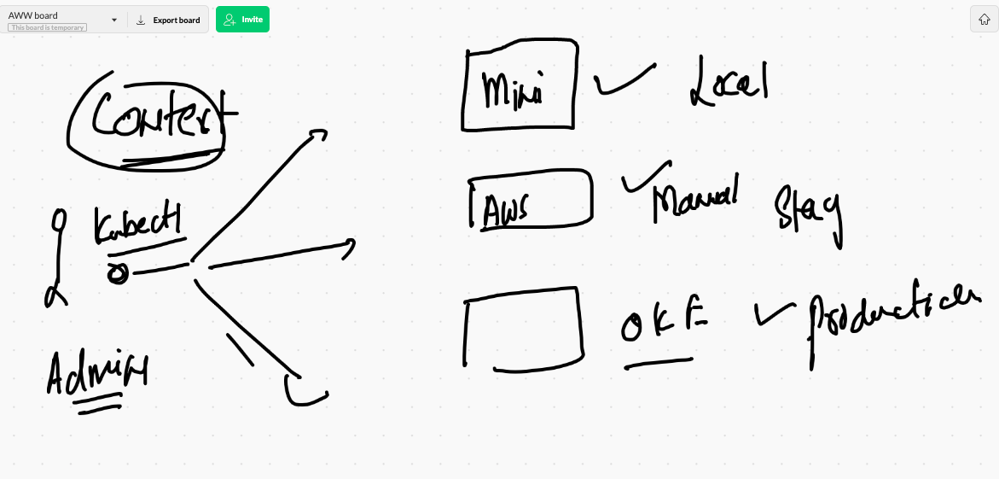
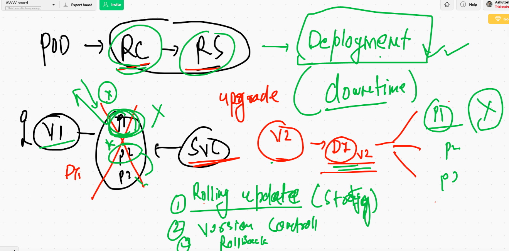
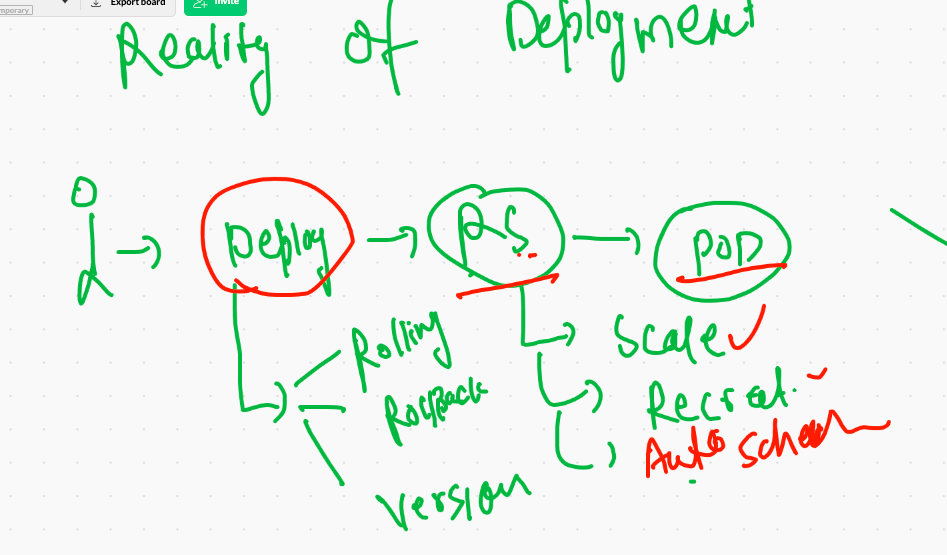
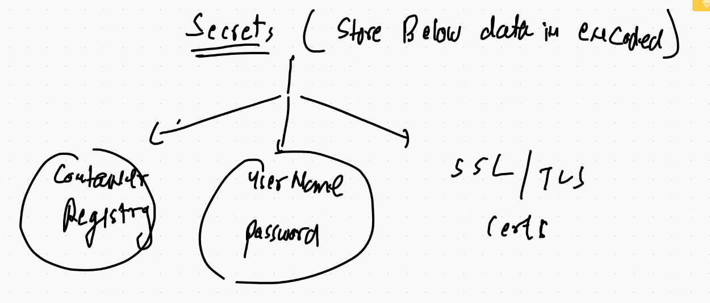
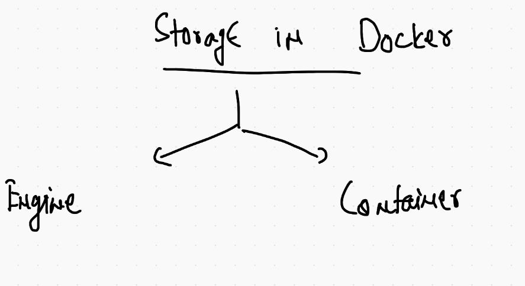

# FInal Day workflow 



## changing current namespace 

```
kubectl  config set-context  --current  --namespace=ashuproject1

```

## Deployment of RC 

```
❯ kubectl get  rc
No resources found in ashuproject1 namespace.
❯ kubectl apply -f  ashuapp1.yaml
replicationcontroller/ashuapp1 created
❯ kubectl get  rc
NAME       DESIRED   CURRENT   READY   AGE
ashuapp1   1         1         1       8s
❯ kubectl  get  po
NAME             READY   STATUS    RESTARTS   AGE
ashuapp1-p9gdn   1/1     Running   0          41s
❯ kubectl  get  po -o wide
NAME             READY   STATUS    RESTARTS   AGE   IP               NODE          NOMINATED NODE   READINESS GATES
ashuapp1-p9gdn   1/1     Running   0          55s   192.168.214.20   k8s-minion3   <none>           <none>
❯ kubectl delete  pod ashuapp1-p9gdn
pod "ashuapp1-p9gdn" deleted
❯ kubectl  get  po -o wide
NAME             READY   STATUS    RESTARTS   AGE   IP               NODE          NOMINATED NODE   READINESS GATES
ashuapp1-8gddh   1/1     Running   0          34s   192.168.214.21   k8s-minion3   <none>           <none>

```

## Explose RC to create service with auto matched label of pods

```
❯ kubectl get  rc
NAME       DESIRED   CURRENT   READY   AGE
ashuapp1   1         1         1       13m
❯ kubectl get  po
NAME             READY   STATUS    RESTARTS   AGE
ashuapp1-8gddh   1/1     Running   0          11m
❯ 
❯ 
❯ kubectl get svc
No resources found in ashuproject1 namespace.
❯ kubectl  expose  rc  ashuapp1  --type NodePort --port 1234 --target-port 8080 --name myjspsvc
service/myjspsvc exposed
❯ kubectl get  svc
NAME       TYPE       CLUSTER-IP      EXTERNAL-IP   PORT(S)          AGE
myjspsvc   NodePort   10.101.205.25   <none>        1234:30834/TCP   5s

```

## scaling pod manually 

```
❯ kubectl  scale rc  ashuapp1  --replicas=5
replicationcontroller/ashuapp1 scaled
❯ kubectl  get   rc
NAME       DESIRED   CURRENT   READY   AGE
ashuapp1   5         5         5       29m
❯ kubectl  get   po -o wide
NAME             READY   STATUS    RESTARTS   AGE     IP               NODE          NOMINATED NODE   READINESS GATES
ashuapp1-8gddh   1/1     Running   0          27m     192.168.214.21   k8s-minion3   <none>           <none>
ashuapp1-97l9r   1/1     Running   0          3m37s   192.168.214.27   k8s-minion3   <none>           <none>
ashuapp1-bnmj5   1/1     Running   0          10s     192.168.27.214   k8s-minion2   <none>           <none>
ashuapp1-j7p8f   1/1     Running   0          10s     192.168.27.213   k8s-minion2   <none>           <none>
ashuapp1-jw9d2   1/1     Running   0          10s     192.168.214.29   k8s-minion3   <none>           <none>

```

## Introduction to deployment in k8s



## Reality of Deployment 




## deleting all resource in k8s under namespace 

```
 kubectl delete  all --all
pod "ashuapp1-8gddh" deleted
replicationcontroller "ashuapp1" deleted
service "myjspsvc" deleted


```
## taking sample app 

### image building for app v1 

```
❯ docker  build  -t  dockerashu/myapp:v1  https://github.com/redashu/testwebapp.git\#main
Sending build context to Docker daemon  75.26kB
Step 1/5 : FROM nginx
latest: Pulling from library/nginx
a076a628af6f: Already exists 
0732ab25fa22: Pull complete 
d7f36f6fe38f: Pull complete 
f72584a26f32: Pull complete 
7125e4df9063: Pull complete 
Digest: sha256:10b8cc432d56da8b61b070f4c7d2543a9ed17c2b23010b43af434fd40e2ca4aa
Status: Downloaded newer image for nginx:latest
 ---> f6d0b4767a6c
Step 2/5 : MAINTAINER ashutoshh@linux.com
 ---> Running in deed6f5f57eb
Removing intermediate container deed6f5f57eb
 ---> 816a9cde8f6a
Step 3/5 : ADD ashu.html /usr/share/nginx/html/index.html
 ---> 21bd7fe7f800
Step 4/5 : COPY k8s.png /usr/share/nginx/html/k8s.png
 ---> 86573b98df06
Step 5/5 : EXPOSE 80
 ---> Running in fbb98b837363
Removing intermediate container fbb98b837363
 ---> 77957dc624c3
Successfully built 77957dc624c3
Successfully tagged dockerashu/myapp:v1

```

## pushing image to docker hub (public repo)

```
6106  docker login -u dockerashu
 6107  docker  push   dockerashu/myapp:v1
```

## PUshing image to OCR 

```
❯ docker  login  phx.ocir.io
Username: axmbtg8judkl/learntechbyme@gmail.com

====

❯ docker  tag 77957dc624c3  phx.ocir.io/axmbtg8judkl/myapp:orv1
❯ docker push  phx.ocir.io/axmbtg8judkl/myapp:orv1
The push refers to repository [phx.ocir.io/axmbtg8judkl/myapp]
ebf8891039c7: Pushed 
d003d65dcbc2: Pushed 
85fcec7ef3ef: Pushed 
3e5288f7a70f: Pushed 
56bc37de0858: Pushed 
1c91bf69a08b: Pushed 
cb42413394c4: Pushed 
orv1: digest: sha256:a00b8fb0384cbe3dff185256ffa510c96247cc759ec255ff20cf9edb2f02a105 size: 1777

```
## creating deployment in k8s using docker hub image

```
 kubectl  create  deployment ashuwebdep  --image=dockerashu/myapp:v1  --dry-run=client -o yaml
apiVersion: apps/v1
kind: Deployment
metadata:
  creationTimestamp: null
  labels:
    app: ashuwebdep
  name: ashuwebdep
spec:
  replicas: 1
  selector:
    matchLabels:
      app: ashuwebdep
  strategy: {}
  template:
    metadata:
      creationTimestamp: null
      labels:
        app: ashuwebdep
    spec:
      containers:
      - image: dockerashu/myapp:v1
        name: myapp
        resources: {}
status: {}
❯ kubectl  create  deployment ashuwebdep  --image=dockerashu/myapp:v1  --dry-run=client -o yaml  >deploy1.yaml

```

## Deployment 

```
❯ kubectl  config  get-contexts
CURRENT   NAME                          CLUSTER      AUTHINFO           NAMESPACE
*         kubernetes-admin@kubernetes   kubernetes   kubernetes-admin   ashuproject1
❯ kubectl apply -f  deploy1.yaml
deployment.apps/ashuwebdep created
❯ kubectl  get  deployment
NAME         READY   UP-TO-DATE   AVAILABLE   AGE
ashuwebdep   1/1     1            1           9s
❯ kubectl  get  deploy
NAME         READY   UP-TO-DATE   AVAILABLE   AGE
ashuwebdep   1/1     1            1           12s
❯ kubectl get  rs
NAME                   DESIRED   CURRENT   READY   AGE
ashuwebdep-775f8d9bc   1         1         1       17s
❯ kubectl get  po
NAME                         READY   STATUS    RESTARTS   AGE
ashuwebdep-775f8d9bc-n26px   1/1     Running   0          21s

```

## Deployment to service create 

```
❯ kubectl  get  deploy
NAME         READY   UP-TO-DATE   AVAILABLE   AGE
ashuwebdep   1/1     1            1           3m24s
❯ kubectl  expose deployment ashuwebdep  --type LoadBalancer --port 1234 --target-port 80 --name ashusvc123
service/ashusvc123 exposed
❯ kubectl get  svc
NAME         TYPE           CLUSTER-IP     EXTERNAL-IP   PORT(S)          AGE
ashusvc123   LoadBalancer   10.98.30.199   <pending>     1234:30072/TCP   4s

```
## updating app 

```
6162  docker  build  -t  dockerashu/myapp:v2  https://github.com/redashu/testwebapp.git\#main
 6163  docker push dockerashu/myapp:v2
 6164  history
 6165  docker images
 6166  history
 6167  kubectl describe deploy ashuwebdep
 6168  kubectl  set  image deployment ashuwebdep  myapp=dockerashu/myapp:v2
 6169  kubectl  get deploy 
 6170  kubectl describe deploy ashuwebdep
 
 ```
 
 ## checking version history 
 
 ```
 ❯ kubectl  rollout  history deployment ashuwebdep
deployment.apps/ashuwebdep 
REVISION  CHANGE-CAUSE
1         <none>
2         <none>


```

## rollback 

```
❯ kubectl  rollout  history deployment ashuwebdep
deployment.apps/ashuwebdep 
REVISION  CHANGE-CAUSE
1         <none>
2         <none>

❯ kubectl rollout undo deployment ashuwebdep  --to-revision=1
deployment.apps/ashuwebdep rolled back
❯ kubectl  rollout status  deployment ashuwebdep
deployment "ashuwebdep" successfully rolled out

```

## Deployment using private registry based docker image

```
kubectl  create  deployment  privdep --image=phx.ocir.io/axmbtg8judkl/myapp:orv1  --dry-run=client -o yaml >pdep.yml

```

# SEcret in k8s



## creating secret 

```
kubectl  create  secret   docker-registry  ashuocr1  --docker-server=phx.ocir.io --docker-username=axmbtg8judkl/learntechbyme@gmail.com  --docker-password=  -n ashuproject1

```


## Injecting secret in YAML 

```
apiVersion: apps/v1
kind: Deployment
metadata:
  creationTimestamp: null
  labels:
    app: privdep
  name: privdep
spec:
  replicas: 1
  selector:
    matchLabels:
      app: privdep
  strategy: {}
  template:
    metadata:
      creationTimestamp: null
      labels:
        app: privdep
    spec:
      imagePullSecrets:
      - name: ashuocr1 # calling secret 
      containers:
      - image: phx.ocir.io/axmbtg8judkl/myapp:orv1
        name: myapp
        resources: {}
status: {}

```

# STORAGE in k8s



[volumes](https://kubernetes.io/docs/concepts/storage/volumes/)

# emptyDir volume 

## Case 1 

```
apiVersion: v1
kind: Pod
metadata:
  creationTimestamp: null
  labels:
    run: ashupod1
  name: ashupod1
spec:
  containers:
  - image: alpine
    name: ashupod1
    command: ["/bin/sh","-c","ping google.com"] # to define partent process
    resources: {}
  dnsPolicy: ClusterFirst
  restartPolicy: Always
status: {}


```

# using emptyDir volume type 

```
apiVersion: v1
kind: Pod
metadata:
  creationTimestamp: null
  labels:
    run: ashupod1
  name: ashupod1
spec:
  volumes: # to create volumes 
  - name: ashuvol1 # name of volume  
    emptyDir: {} # {} means a random directory will be created on scheduled minion node
  containers:
  - image: alpine
    name: ashupod1
    volumeMounts: # mounting volume created above
    - name: ashuvol1 # name of volume as created above 
      mountPath: /mnt/oracle # this location will be created in container
    command: ["/bin/sh","-c","while true;do echo 'Hello Oralce' >>/mnt/oracle/data.txt ; sleep 5 ; done"] # to define partent process
    resources: {}
  dnsPolicy: ClusterFirst
  restartPolicy: Always
status: {}


```

# Multi container POd 


```
apiVersion: v1
kind: Pod
metadata:
  creationTimestamp: null
  labels:
    run: ashupod1
  name: ashupod1
spec:
  volumes: # to create volumes 
  - name: ashuvol1 # name of volume  
    emptyDir: {} # {} means a random directory will be created on scheduled minion node
  containers:
  - image: nginx # first & web server container 
    name: ashuc12
    ports:
    - containerPort: 80
    volumeMounts:
    - name: ashuvol1
      mountPath: /usr/share/nginx/html/
      readOnly: True
  - image: alpine
    name: ashupod1
    volumeMounts: # mounting volume created above
    - name: ashuvol1 # name of volume as created above 
      mountPath: /mnt/oracle # this location will be created in container
    command: ["/bin/sh","-c","while true;do echo 'Hello Oralce' >>/mnt/oracle/data.txt ; sleep 5 ; done"] # to define partent process
    resources: {}
  dnsPolicy: ClusterFirst
  restartPolicy: Always
status: {}

```

###

```
❯ kubectl apply -f multicpod.yaml
pod/ashupod1 created
❯ kubectl get  po
NAME       READY   STATUS    RESTARTS   AGE
ashupod1   2/2     Running   0          5s
❯ kubectl expose pod ashupod1 --type NodePort --port 1234 --target-port 80 --name x1
service/x1 exposed
❯ kubectl get  svc
NAME   TYPE       CLUSTER-IP     EXTERNAL-IP   PORT(S)          AGE
x1     NodePort   10.96.60.119   <none>        1234:30742/TCP   6s

```


