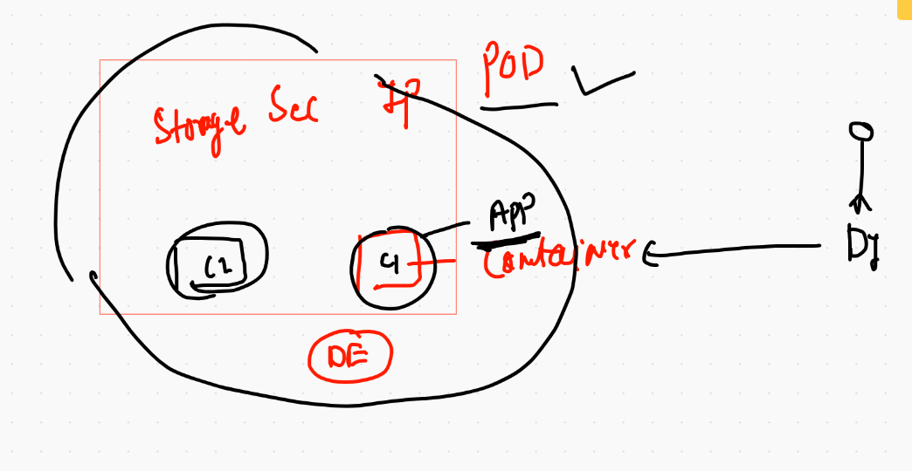

# Application deployment using K8s

## k8s deploy container images by creating Pod 


## Pod more close 



## checking minikube based k8s cluster status 

```
❯ kubectl  get  no
NAME           STATUS   ROLES                  AGE   VERSION
minikube       Ready    control-plane,master   17h   v1.20.2
minikube-m02   Ready    <none>                 24m   v1.20.2
❯ kubectl  get  nodes
NAME           STATUS   ROLES                  AGE   VERSION
minikube       Ready    control-plane,master   17h   v1.20.2
minikube-m02   Ready    <none>                 24m   v1.20.2
❯ 
❯ kubectl  get  pods
No resources found in default namespace.

```

## Pod Design format 


## FIrst pod design

```
apiVersion: v1
kind: Pod
metadata:
 name: ashu-pod-1 # name of my pod
spec: # info about application
 containers:
 - image: nginx # image from docker hub 
   name: ashuc1 # name of container 
   ports: # default port of application 
   - containerPort: 80
   
```

## checking syntax 

```
❯ kubectl  apply -f ashupod1.yaml --dry-run=client
pod/ashu-pod-1 created (dry run)

```
## deploying pod 

```
❯ kubectl  apply -f ashupod1.yaml
pod/ashu-pod-1 created
❯ kubectl get po
NAME         READY   STATUS              RESTARTS   AGE
ashu-pod-1   0/1     ContainerCreating   0          15s
❯ kubectl get po
NAME         READY   STATUS    RESTARTS   AGE
ashu-pod-1   1/1     Running   0          36s
❯ kubectl get pod
NAME         READY   STATUS    RESTARTS   AGE
ashu-pod-1   1/1     Running   0          38s

```

## More info about POD 

```
❯ kubectl  describe  pod  ashu-pod-1
Name:         ashu-pod-1
Namespace:    default
Priority:     0
Node:         minikube-m02/192.168.49.3
Start Time:   Thu, 04 Feb 2021 10:31:30 +0530
Labels:       <none>
Annotations:  <none>
Status:       Running
IP:           172.17.0.2
IPs:
  IP:  172.17.0.2
Containers:
  ashuc1:
    Container ID:   docker://9fb312d9087729c1562489f04e84985cd9dc49edbccf3584dcbf2c5b626c2f1f
    Image:          nginx
    Image ID:       docker-pullable://nginx@sha256:10b8cc432d56da8b61b070f4c7d2543a9ed17c2b23010b43af434fd40e2ca4aa
    Port:           80/TCP
    Host Port:      0/TCP
    State:          Running
      Started:      Thu, 04 Feb 2021 10:32:02 +0530
    Ready:          True
    Restart Count:  0

```

## check host schedule

```
❯ kubectl get pod -o wide
NAME         READY   STATUS    RESTARTS   AGE     IP           NODE           NOMINATED NODE   READINESS GATES
ashu-pod-1   1/1     Running   0          6m13s   172.17.0.2   minikube-m02   <none>           <none>


```

## accessing container of a Pod

```
❯ kubectl  exec -it  ashu-pod-1  -- bash
root@ashu-pod-1:/# 
root@ashu-pod-1:/# cat /etc/os-release 
PRETTY_NAME="Debian GNU/Linux 10 (buster)"
NAME="Debian GNU/Linux"
VERSION_ID="10"
VERSION="10 (buster)"
VERSION_CODENAME=buster
ID=debian
HOME_URL="https://www.debian.org/"
SUPPORT_URL="https://www.debian.org/support"
BUG_REPORT_URL="https://bugs.debian.org/"
root@ashu-pod-1:/# cd  /usr/share/nginx/html/
root@ashu-pod-1:/usr/share/nginx/html# ls
50x.html  index.html

```

## connecting to a particular container inside pod 

```
kubectl  exec -it  ashu-pod-1 -c ashuc1  -- bash

```

## pod delete 

```
 kubectl delete pod  ashu-pod-1
pod "ashu-pod-1" deleted

```

## auto generation of POD yaml 

```
❯ kubectl run hellopod1  --image=nginx --port 80 --dry-run=client  -o yaml
apiVersion: v1
kind: Pod
metadata:
  creationTimestamp: null
  labels:
    run: hellopod1
  name: hellopod1
spec:
  containers:
  - image: nginx
    name: hellopod1
    ports:
    - containerPort: 80
    resources: {}
  dnsPolicy: ClusterFirst
  restartPolicy: Always
status: {}

```

## POd generate into json format 

```
 kubectl run hellopod1  --image=nginx --port 80 --dry-run=client  -o json
{
    "kind": "Pod",
    "apiVersion": "v1",
    "metadata": {
        "name": "hellopod1",
        "creationTimestamp": null,
        "labels": {
            "run": "hellopod1"
        }
    },
    "spec": {
        "containers": [
            {
                "name": "hellopod1",
                "image": "nginx",
                "ports": [
                    {
                        "containerPort": 80
                    }
                ],
                "resources": {}
            }
        ],

```

## generate pod yaml/json and store in a file 

```
kubectl run hellopod1  --image=nginx --port 80 --dry-run=client  -o yaml  >ashupod2.yaml

```

# Accessing application running in POD 

## Case 1 -- when you are client of kubernetes 

```
 kubectl  port-forward  hellopod1  3333:80
Forwarding from 127.0.0.1:3333 -> 80
Forwarding from [::1]:3333 -> 80
Handling connection for 3333
Handling connection for 3333

```

## Pod application access problem 


## label will be used by service to find the Pods


## Pod with Label 

```
apiVersion: v1
kind: Pod
metadata:
 name: ashu-pod-1 # name of my pod
 labels: # identity to my pod that will be used by service
  x: helloashu  # it will be key: value format 
spec: # info about application
 containers:
 - image: nginx # image from docker hub 
   name: ashuc1 # name of container 
   ports: # default port of application 
   - containerPort: 80
   
```

## label checking 

```
 kubectl  get  po  --show-labels -o wide
NAME         READY   STATUS    RESTARTS   AGE   IP           NODE           NOMINATED NODE   READINESS GATES   LABELS
ashu-pod-1   1/1     Running   0          32s   172.17.0.2   minikube-m02   <none>           <none>            x=helloashu

```
##  service type in k8s


## Nodeport service type 


## creating nodeport service 

```
kubectl  create  service  nodeport  ashus1  --tcp  1234:80  --dry-run=client -o yaml  >ashusvc1.yaml

```

## service nodeport yaml explain 

```
apiVersion: v1
kind: Service
metadata:
  creationTimestamp: null
  labels: # label of service 
    app: ashus1
  name: ashus1 # name of service 
spec:
  ports:
  - name: 1234-80
    port: 1234 # service port number 
    protocol: TCP
    targetPort: 80 # target application port 
  selector: # this is the Finder of pod using label 
   x: helloashu # this is the Label of Pod 
  type: NodePort # type of service 
status:
  loadBalancer: {}

```

## deployment of service nodeport 

```
 kubectl  apply -f  ashusvc1.yaml
service/ashus1 created
❯ kubectl   get  service
NAME         TYPE        CLUSTER-IP     EXTERNAL-IP   PORT(S)          AGE
ashus1       NodePort    10.97.30.168   <none>        1234:31293/TCP   6s

```

# remote k8s cluster connect

```
 kubectl  get  nodes  --kubeconfig  Desktop/admin.conf
NAME             STATUS   ROLES                  AGE   VERSION
k8s-masternode   Ready    control-plane,master   11m   v1.20.2
k8s-minion1      Ready    <none>                 11m   v1.20.2
k8s-minion2      Ready    <none>                 11m   v1.20.2
k8s-minion3      Ready    <none>                 11m   v1.20.2
❯ cd  Desktop
❯ kubectl  get  nodes  --kubeconfig  admin.conf
NAME             STATUS   ROLES                  AGE   VERSION
k8s-masternode   Ready    control-plane,master   12m   v1.20.2
k8s-minion1      Ready    <none>                 11m   v1.20.2
k8s-minion2      Ready    <none>                 11m   v1.20.2
k8s-minion3      Ready    <none>                 11m   v1.20.2

```

## label service 


# Namespace 


```
❯ kubectl  get  namespace
NAME              STATUS   AGE
default           Active   103m
kube-node-lease   Active   103m
kube-public       Active   103m
kube-system       Active   103m

```
## Internal k8s component 

```
❯ kubectl  get  pods  -n kube-system
NAME                                       READY   STATUS    RESTARTS   AGE
calico-kube-controllers-744cfdf676-f9gbw   1/1     Running   0          103m
calico-node-22rmm                          1/1     Running   0          103m
calico-node-4sddc                          1/1     Running   0          103m
calico-node-bq5qp                          1/1     Running   0          103m
calico-node-g55jq                          1/1     Running   0          103m
coredns-74ff55c5b-rzgw5                    1/1     Running   0          105m
coredns-74ff55c5b-v5jdf                    1/1     Running   0          105m
etcd-k8s-masternode                        1/1     Running   0          105m
kube-apiserver-k8s-masternode              1/1     Running   0          105m
kube-controller-manager-k8s-masternode     1/1     Running   0          105m
kube-proxy-7bx6g                           1/1     Running   0          105m
kube-proxy-wq88z                           1/1     Running   0          105m
kube-proxy-zl582                           1/1     Running   0          105m
kube-proxy-zmtpq                           1/1     Running   0          105m
kube-scheduler-k8s-masternode              1/1     Running   0          105m

```

## Namespace creation 

```
❯ kubectl  create  namespace  ashuproject1
namespace/ashuproject1 created
❯ kubectl  get  ns
NAME              STATUS   AGE
ashuproject1      Active   6s
default           Active   107m
kube-node-lease   Active   107m
kube-public       Active   107m
kube-system       Active   107m

```
## pod & svc deployment in custom namespace 

```
5987  kubectl  create  namespace  ashuproject1
 5988  kubectl  get  ns
 5989  kubectl apply -f  ashupod1.yaml 
 5990  kubectl apply -f  ashusvc1.yaml
 5991  kubectl get  po 
 5992  kubectl get  po  -n ashuproject1
 5993  kubectl get svc  -n ashuproject1
 5994  kubectl get svc,pod  -n ashuproject1
❯ kubectl get  all -n ashuproject1
NAME             READY   STATUS    RESTARTS   AGE
pod/ashu-pod-1   1/1     Running   0          66s

NAME             TYPE       CLUSTER-IP      EXTERNAL-IP   PORT(S)          AGE
service/ashus1   NodePort   10.111.122.81   <none>        1234:32115/TCP   60s

```


## delete all from customn 

```
❯ kubectl delete all --all -n ashuproject1
pod "ashu-pod-1" deleted
service "ashus1" deleted
```

# Replication controller (RC)


```
apiVersion: v1
kind: ReplicationController
metadata:
 name: ashuapp1
 namespace: ashuproject1
spec:
 replicas: 1 # no of pod you want 
 template: # RC will be using templates to create POD 
  metadata:
   labels:
    x: helloashu
  spec:
   containers:
   - image: dockerashu/ashujsp:v001 # tomcat image
     name: ashuc1
     ports:
     - containerPort: 8080
 ```
 
 
