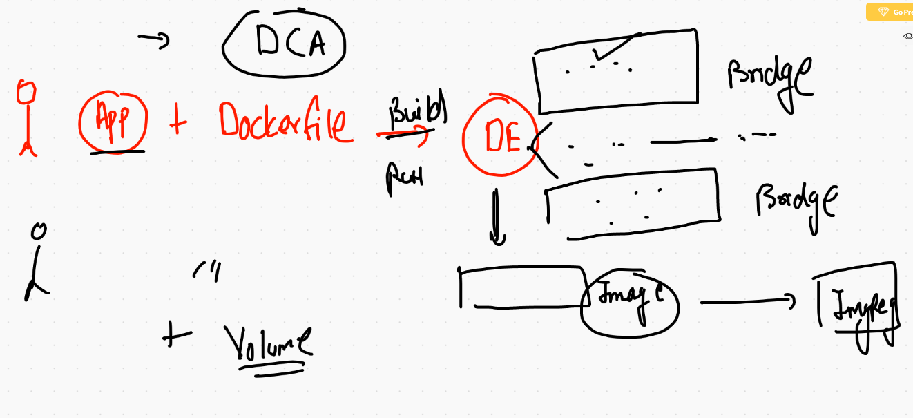

# REcap



# Docker volume 

## Volume concepts 


## creating volume 

```
docker volume  create  ashuvol123 

```

## checking storage location to Docker engine side

```
❯ docker volume  inspect  ashuvol123
[
    {
        "CreatedAt": "2021-02-03T04:25:45Z",
        "Driver": "local",
        "Labels": {},
        "Mountpoint": "/var/lib/docker/volumes/ashuvol123/_data",
        "Name": "ashuvol123",
        "Options": {},
        "Scope": "local"
    }
]

```

## a closure look to volume 


## Mysql Db 

```
 docker  run  -d  --name ashudb -e  MYSQL_ROOT_PASSWORD=mypass  -v ashuvol123:/var/lib/mysql  mysql 
 
```

## A directory as volume in Readonly permission 

```
❯ docker  run -it  --name x1 -v  /etc:/myetc:ro   alpine  sh
/ # cd  /myetc/
/myetc # ls
afpovertcp.cfg                         localtime                              postfix
aliases                                locate.rc                              ppp
aliases.db                             mail.rc                                profile
apache2                                man.conf                               protocols
asl                                    manpaths                               racoon
asl.conf                               manpaths.d                             rc.common
auto_home                   

```

## sharing 

```
docker  run -it  --name x2 -v  /etc:/myetc:ro -v /opt:/xyz:rw   alpine  sh 

```
## sharing file as volume 

```
docker  run -it  --name x11 -v  /etc/passwd:/hello.txt    alpine  sh
```

## portainer deployment 

```
docker  run  -d --name ashuwebui -p 1100:9000 -v /var/run/docker.sock:/var/run/docker.sock portainer/portainer
```

# IAC -- Using Docker compose 


## checking compose version 

```
❯ docker-compose -v
docker-compose version 1.27.4, build 40524192

```
## docker-compose install link manually 

[docker compose link](https://docs.docker.com/compose/install/)

## Docker compsoe install on Linux host 

```
 82  sudo curl -L "https://github.com/docker/compose/releases/download/1.28.2/docker-compose-$(uname -s)-$(uname -m)" -o /usr/local/bin/docker-compose
   83  sudo chmod +x /usr/local/bin/docker-compose
   84  sudo ln -s /usr/local/bin/docker-compose /usr/bin/docker-compose
   85  docker-compose  -v

```

## docker compose file version 

[compose](https://docs.docker.com/compose/compose-file/)

## Docker compose file format 


## Example 1

```
version: "3.8"
networks: # for creating bridge network in DE
 ashubrx1: # name of bridge

services:
 ashuapp1: # first app/svc name
  image: alpine
  container_name: ashuc123
  command: ping google.com 
  networks: # for using network 
   - ashubrx1  # name of network created below

# docker compose file v3 can automatically create network if we don't define

## IN docker cli 
# docker network create ashubrx1 
# docker run --name ashuc123 --network ashubrx1 alpine ping google.com

```

## deployment of compose file 

```
❯ ls
docker-compose.yaml
❯ docker-compose up -d
Creating network "mycompose_ashubrx1" with the default driver
Creating ashuc123 ... done
❯ docker-compose  ps
  Name         Command       State   Ports
------------------------------------------
ashuc123   ping google.com   Up 

```

## compsoe more commands

```
❯ docker-compose  ps
  Name         Command       State   Ports
------------------------------------------
ashuc123   ping google.com   Up           
❯ docker-compose  kill
Killing ashuc123 ... done
❯ docker-compose  ps
  Name         Command        State     Ports
---------------------------------------------
ashuc123   ping google.com   Exit 137        
❯ docker-compose  start
Starting ashuapp1 ... done
❯ docker-compose  ps
  Name         Command       State   Ports
------------------------------------------
ashuc123   ping google.com   Up           

```

## docker compose history 

```
5679  docker-compose up -d 
 5680  docker-compose  ps
 5681  docker-compose  logs 
 5682  docker-compose  logs -f
 5683  history
 5684  docker-compose  ps
 5685  docker-compose  kill
 5686  docker-compose  ps
 5687  docker-compose  start
 5688  docker-compose  ps
 5689  docker-compose  stop
 5690  docker-compose  ps
 5691  docker-compose  start
 5692  history
 5693  ls
 5694  docker-compose
 5695  docker-compose  version 
 5696  docker-compose  images
 5697  docker-compose ps
 5698  docker-compose kill 
 5699  docker-compose rm 
 5700  docker-compose ps
 5701  docker-compose up -d
 5702  docker-compose ps
❯ docker-compose down
Stopping ashuc123 ... done
Removing ashuc123 ... done
Removing network mycompose_ashubrx1

```


## if compose has a different file name 

```
❯ ls
docker-compose.yaml
❯ mv  docker-compose.yaml ashu.yml
❯ ls
ashu.yml
❯ docker-compose up -d
ERROR: 
        Can't find a suitable configuration file in this directory or any
        parent. Are you in the right directory?

        Supported filenames: docker-compose.yml, docker-compose.yaml
        
❯ docker-compose -f  ashu.yml   up -d
Creating network "mycompose_ashubrx1" with the default driver
Creating ashuc123 ... done
❯ docker-compose -f  ashu.yml   ps
  Name         Command       State   Ports
------------------------------------------
ashuc123   ping google.com   Up           
❯ docker-compose -f  ashu.yml   down
Stopping ashuc123 ... done
Removing ashuc123 ... done
Removing network mycompose_ashubrx1

```

## compose for DB deployment 

```
version: "3.8"
volumes: # creating volume
 ashdbvol1: # name of volume
networks:  # creating network that is optional since v2 of compose file
 ashubrx2: # name of network 

services:
 ashudb1:
  image: mysql # image from docker hub if not present
  container_name: ashudbc1 # optional 
  environments: # passing env variable 
   MYSQL_ROOT_PASSWORD: Oracle123 
  volumes: # to attach volume created above
   -  "ashudbvol1:/var/lib/mysql" # mounting volume 

```


## compsoe with dockerfile 

```
version: "3.8"
services:
  ashuapp3: # name of application 
    image: ashuhttpd:v007 # the image i want to build
    build:  # to call dockerfile -
      context: . # location of Dockerfile
      dockerfile: httpd.dockerfile # name of dockerfile 
    container_name: ashucweb1 # name of container 
    ports: # this is similar to docker run -p 3344:80 
      - "3344:80"
# Network will be created automatically bcz we are using compose file v3

```

## build using compose 

```
 ls
docker-compose.yaml  httpd.dockerfile     mycompose            project-html-website
❯ docker-compose up  -d
Creating network "javacodes_default" with the default driver
Building ashuapp3
Step 1/7 : from oraclelinux:8.3
8.3: Pulling from library/oraclelinux
74e9dff7c98f: Pull complete
Digest: sha256:9006284e283e3872254969fbc52d02d193c7e1a6a4c46949e4c421779132260d
Status: Downloaded newer image for oraclelinux:8.3
 ---> 62ef2e8acbb6
Step 2/7 : MAINTAINER  ashutoshh
 ---> Running in dc01aeaf402a
Removing intermediate container dc01aeaf402a
 ---> 84a904cf7e46
Step 3/7 : RUN yum  install httpd -y
 ---> Running in fbd7c1d73d47
Oracle Linux 8 BaseOS Latest (x86_64)           6.9 MB/s |  29 MB     00:04    
Oracle Linux 8 Application Stream (x86_64)      7.5 MB/s |  22 MB     00:02    
Last metadata expiration check: 0:00:12 ago on Wed Feb  3 07:06:34 2021.
Dependencies resolved.
=================================================================================================
 Package              Arch    Version                                    Repository          Size
=================================================================================================
Installing:
 httpd                x86_64  2.4.37-30.0.1.module+el8.3.0+7816+49791cfd ol8_appstream      1.4 M
Installing dependencies:
 apr                  x86_64  1.6.3-11.el8                               ol8_appstream      125 k
 apr-util             x86_64  1.6.1-6.el8                                ol8_appstream      105 k
 httpd-filesystem     noarch  2.4.37-30.0.1.module+el8.3.0+7816+49791cfd ol8_appstream       37 k
 httpd-tools          x86_64  2.4.37-30.0.1.module+el8.3.0+7816+49791cfd ol8_appstream      104 k
 mailcap              noarch  2.1.48-3.el8                               ol8_baseos_latest   39 k
 mod_http2            x86_64  1.15.7-2.module+el8.3.0+7816+49791cfd      ol8_appstream      154 k
 oracle-logos-httpd   noarch  80.5-1.0.6.el8                             ol8_baseos_latest   27 k
Enabling module streams:
 httpd                        2.4                                                                

Transaction Summary
=================================================================================================
Install  8 Packages

Total download size: 2.0 M
Installed size: 5.4 M
Downloading Packages:
(1/8): mailcap-2.1.48-3.el8.noarch.rpm          166 kB/s |  39 kB     00:00    
(2/8): oracle-logos-httpd-80.5-1.0.6.el8.noarch 113 kB/s |  27 kB     00:00    
(3/8): apr-util-1.6.1-6.el8.x86_64.rpm          417 kB/s | 105 kB     00:00    
(4/8): httpd-tools-2.4.37-30.0.1.module+el8.3.0 1.1 MB/s | 104 kB     00:00    
(5/8): mod_http2-1.15.7-2.module+el8.3.0+7816+4 1.1 MB/s | 154 kB     00:00    
(6/8): httpd-filesystem-2.4.37-30.0.1.module+el 906 kB/s |  37 kB     00:00    
(7/8): apr-1.6.3-11.el8.x86_64.rpm              1.0 MB/s | 125 kB     00:00    
(8/8): httpd-2.4.37-30.0.1.module+el8.3.0+7816+ 4.8 MB/s | 1.4 MB     00:00    
--------------------------------------------------------------------------------
Total                                           3.4 MB/s | 2.0 MB     00:00     
Running transaction check
Transaction check succeeded.
Running transaction test
Transaction test succeeded.
Running transaction
  Preparing        :                                                        1/1 
  Installing       : apr-1.6.3-11.el8.x86_64                                1/8 
  Running scriptlet: apr-1.6.3-11.el8.x86_64                                1/8 
  Installing       : apr-util-1.6.1-6.el8.x86_64                            2/8 
  Running scriptlet: apr-util-1.6.1-6.el8.x86_64                            2/8 
  Installing       : httpd-tools-2.4.37-30.0.1.module+el8.3.0+7816+49791c   3/8 
  Running scriptlet: httpd-filesystem-2.4.37-30.0.1.module+el8.3.0+7816+4   4/8 
  Installing       : httpd-filesystem-2.4.37-30.0.1.module+el8.3.0+7816+4   4/8 
  Installing       : oracle-logos-httpd-80.5-1.0.6.el8.noarch               5/8 
  Installing       : mailcap-2.1.48-3.el8.noarch                            6/8 
  Installing       : mod_http2-1.15.7-2.module+el8.3.0+7816+49791cfd.x86_   7/8 
  Installing       : httpd-2.4.37-30.0.1.module+el8.3.0+7816+49791cfd.x86   8/8 
  Running scriptlet: httpd-2.4.37-30.0.1.module+el8.3.0+7816+49791cfd.x86   8/8 
  Verifying        : mailcap-2.1.48-3.el8.noarch                            1/8 
  Verifying        : oracle-logos-httpd-80.5-1.0.6.el8.noarch               2/8 
  Verifying        : apr-util-1.6.1-6.el8.x86_64                            3/8 
  Verifying        : mod_http2-1.15.7-2.module+el8.3.0+7816+49791cfd.x86_   4/8 
  Verifying        : httpd-tools-2.4.37-30.0.1.module+el8.3.0+7816+49791c   5/8 
  Verifying        : httpd-2.4.37-30.0.1.module+el8.3.0+7816+49791cfd.x86   6/8 
  Verifying        : httpd-filesystem-2.4.37-30.0.1.module+el8.3.0+7816+4   7/8 
  Verifying        : apr-1.6.3-11.el8.x86_64                                8/8 

Installed:
  apr-1.6.3-11.el8.x86_64                                                       
  apr-util-1.6.1-6.el8.x86_64                                                   
  httpd-2.4.37-30.0.1.module+el8.3.0+7816+49791cfd.x86_64                       
  httpd-filesystem-2.4.37-30.0.1.module+el8.3.0+7816+49791cfd.noarch            
  httpd-tools-2.4.37-30.0.1.module+el8.3.0+7816+49791cfd.x86_64                 
  mailcap-2.1.48-3.el8.noarch                                                   
  mod_http2-1.15.7-2.module+el8.3.0+7816+49791cfd.x86_64                        
  oracle-logos-httpd-80.5-1.0.6.el8.noarch                                      

Complete!
Removing intermediate container fbd7c1d73d47
 ---> a73cfe03f9f2
Step 4/7 : WORKDIR /var/www/html
 ---> Running in 7c4b0b0b0aac
Removing intermediate container 7c4b0b0b0aac
 ---> dabc60dbeb18
Step 5/7 : COPY project-html-website  .
 ---> 485456467461
Step 6/7 : EXPOSE 80
 ---> Running in 8a184963d815
Removing intermediate container 8a184963d815
 ---> 54c1a0b6717a
Step 7/7 : ENTRYPOINT ["httpd","-DFOREGROUND"]
 ---> Running in b4594e583bca
Removing intermediate container b4594e583bca
 ---> ccbae717eadc

Successfully built ccbae717eadc
Successfully tagged ashuhttpd:v007
WARNING: Image for service ashuapp3 was built because it did not already exist. To rebuild this image you must use `docker-compose build` or `docker-compose up --build`.
Creating ashucweb1 ... done

```
