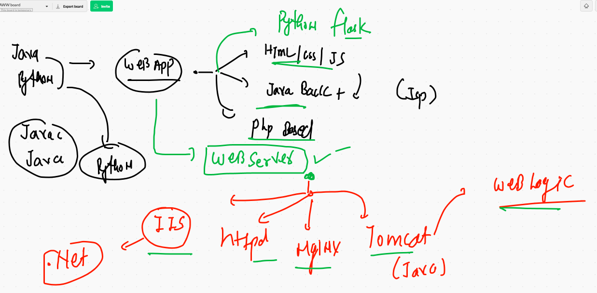

# Docker getting started 

## pre-requiste 


## journey  from Bare-metal to Containers 


## vm problems case 1 


## vms vs containers


# CRE 


## More Info about Docker 


## Docker instation 


## Docker desktop 


## Docker ce. installation on LInux based OS 

```
    4  yum  install docker -y
    5  systemctl enable --now docker 
    6  history 
[root@ip-172-31-32-255 ~]# systemctl status docker 
● docker.service - Docker Application Container Engine
   Loaded: loaded (/usr/lib/systemd/system/docker.service; enabled; vendor preset: disabled)
   Active: active (running) since Mon 2021-02-01 06:25:31 UTC; 9s ago
     Docs: https://docs.docker.com
  Process: 3705 ExecStartPre=/usr/libexec/docker/docker-setup-runtimes.sh (code=exited, status=0/SUCCESS)
  Process: 3691 ExecStartPre=/bin/mkdir -p /run/docker (code=exited, status=0/SUCCESS)
 Main PID: 3714 (dockerd)

```

## Link for installation 

['docker docs'] ('https://docs.docker.com/engine/install/centos/')


## Getting started with containers 

## architecture 


## Image registry 

## docker hub 


## Docker client sending instruction to docker engine 

## searching image on docker hub 

```
5180  docker  search  java 
 5181  docker  search   python 
 5182  docker  search   dockerashu
 5183  docker  search   ashutoshh
 
```

## checking image on docker engine 


```
[root@ip-172-31-32-255 ~]# docker  images
REPOSITORY          TAG                 IMAGE ID            CREATED             SIZE
[root@ip-172-31-32-255 ~]# 

```


## pull image 

```
[root@ip-172-31-32-255 ~]# docker  pull  java 
Using default tag: latest
latest: Pulling from library/java
5040bd298390: Pull complete 
fce5728aad85: Pull complete 
76610ec20bf5: Pull complete 
60170fec2151: Pull complete 
e98f73de8f0d: Pull complete 
11f7af24ed9c: Pull complete 
49e2d6393f32: Pull complete 
bb9cdec9c7f3: Pull complete 
Digest: sha256:c1ff613e8ba25833d2e1940da0940c3824f03f802c449f3d1815a66b7f8c0e9d
Status: Downloaded newer image for java:latest
docker.io/library/java:latest
[root@ip-172-31-32-255 ~]# 
[root@ip-172-31-32-255 ~]# docker  images
REPOSITORY          TAG                 IMAGE ID            CREATED             SIZE
java                latest              d23bdf5b1b1b        4 years ago         643MB

```

## pulling more images 

```
[root@ip-172-31-32-255 ~]# docker  pull  alpine 
Using default tag: latest
latest: Pulling from library/alpine
4c0d98bf9879: Pull complete 
Digest: sha256:08d6ca16c60fe7490c03d10dc339d9fd8ea67c6466dea8d558526b1330a85930
Status: Downloaded newer image for alpine:latest
docker.io/library/alpine:latest
[root@ip-172-31-32-255 ~]# docker  pull  oraclelinux:8.3
8.3: Pulling from library/oraclelinux
989beddc1550: Pull complete 
Digest: sha256:2bb4ec43d6f9fca620f73eda8d924d4c17ab4672b23a76b518a92cb32507bdd1
Status: Downloaded newer image for oraclelinux:8.3
docker.io/library/oraclelinux:8.3
[root@ip-172-31-32-255 ~]# docker  images 
REPOSITORY          TAG                 IMAGE ID            CREATED             SIZE
alpine              latest              e50c909a8df2        3 days ago          5.61MB
python              latest              4b9378be0bb9        6 days ago          885MB
oraclelinux         8.3                 f4a1f2c861ca        2 weeks ago         429MB
java                latest              d23bdf5b1b1b        4 years ago         643MB

```

## Parent process in Container 


# First container creation 

```
❯ docker  run  alpine  cal
   February 2021
Su Mo Tu We Th Fr Sa
    1  2  3  4  5  6
 7  8  9 10 11 12 13
14 15 16 17 18 19 20
21 22 23 24 25 26 27
28
                     
❯ docker  ps
CONTAINER ID   IMAGE     COMMAND   CREATED   STATUS    PORTS     NAMES


❯ docker  ps  -a
CONTAINER ID   IMAGE     COMMAND   CREATED          STATUS                      PORTS     NAMES
d35ebb26b6e3   alpine    "cal"     41 seconds ago   Exited (0) 39 seconds ago             amazing_germain

```


## creating container with custom name 

```
❯ docker  run --name  ashuc1  -d   alpine  ping google.com
f31fb713d2e33474bca6a588a7e30fedbb9be6d1ee27d66cbf482fe356bdf2c4
❯ 
❯ docker  ps
CONTAINER ID   IMAGE     COMMAND             CREATED         STATUS         PORTS     NAMES
f31fb713d2e3   alpine    "ping google.com"   4 seconds ago   Up 3 seconds             ashuc1
❯ docker  ps -a
CONTAINER ID   IMAGE     COMMAND             CREATED          STATUS                      PORTS     NAMES
f31fb713d2e3   alpine    "ping google.com"   8 seconds ago    Up 7 seconds                          ashuc1
7a40438fdf00   alpine    "ping 8.8.8.8"      8 minutes ago    Exited (1) 7 minutes ago              reverent_greider
d35ebb26b6e3   alpine    "cal"               11 minutes ago   Exited (0) 11 minutes ago             amazing_germain
❯ docker logs  ashuc1
PING google.com (142.250.67.142): 56 data bytes


```


## Container start & stop 

```
❯ docker  stop  ashuc1
ashuc1
❯ docker  ps
CONTAINER ID   IMAGE     COMMAND   CREATED   STATUS    PORTS     NAMES
❯ docker  ps -a
CONTAINER ID   IMAGE     COMMAND             CREATED              STATUS                       PORTS     NAMES
f31fb713d2e3   alpine    "ping google.com"   About a minute ago   Exited (137) 6 seconds ago             ashuc1
7a40438fdf00   alpine    "ping 8.8.8.8"      10 minutes ago       Exited (1) 8 minutes ago               reverent_greider
d35ebb26b6e3   alpine    "cal"               13 minutes ago       Exited (0) 13 minutes ago              amazing_germain
❯ docker  start ashuc1
ashuc1
❯ docker  ps
CONTAINER ID   IMAGE     COMMAND             CREATED         STATUS         PORTS     NAMES
f31fb713d2e3   alpine    "ping google.com"   2 minutes ago   Up 3 seconds             ashuc1


```


## case 1 docker done

```
5208  docker  run --name  ashuc1  -d   alpine  ping google.com 
 5209  docker  ps
 5210  docker  ps -a
 5211  docker logs  ashuc1  
 5212  docker  stop  ashuc1
 5213  docker  ps
 5214  docker  ps -a
 5215  docker  start ashuc1
 5216  docker  ps

```

## Remove containers from Docker engine 

```
❯ docker  ps  -a
CONTAINER ID   IMAGE     COMMAND             CREATED          STATUS                      PORTS     NAMES
f31fb713d2e3   alpine    "ping google.com"   6 minutes ago    Up 3 minutes                          ashuc1
7a40438fdf00   alpine    "ping 8.8.8.8"      14 minutes ago   Exited (1) 13 minutes ago             reverent_greider
d35ebb26b6e3   alpine    "cal"               17 minutes ago   Exited (0) 17 minutes ago             amazing_germain
❯ docker rm   reverent_greider  d35ebb26b6e3
reverent_greider
d35ebb26b6e3
❯ docker  ps  -a
CONTAINER ID   IMAGE     COMMAND             CREATED         STATUS         PORTS     NAMES
f31fb713d2e3   alpine    "ping google.com"   6 minutes ago   Up 4 minutes             ashuc1

```

# Docker image building 


## Container created state

```
                    
❯ docker  ps  -a
CONTAINER ID   IMAGE     COMMAND         CREATED          STATUS                     PORTS     NAMES
5f2de7e8f1be   alpine    "cal"           3 seconds ago    Exited (0) 2 seconds ago             x2
3892881fed3b   alpine    "ping fb.com"   15 seconds ago   Up 14 seconds                        x1
❯ docker run  --name x3  alpine calllllll344546565
docker: Error response from daemon: OCI runtime create failed: container_linux.go:370: starting container process caused: exec: "calllllll344546565": executable file not found in $PATH: unknown.
❯ docker  ps  -a
CONTAINER ID   IMAGE     COMMAND                CREATED          STATUS                      PORTS     NAMES
80eb64dcf736   alpine    "calllllll344546565"   3 seconds ago    Created                               x3
5f2de7e8f1be   alpine    "cal"                  29 seconds ago   Exited (0) 28 seconds ago             x2
3892881fed3b   alpine    "ping fb.com"          41 seconds ago   Up 40 seconds                         x1

```

# Docker image building process

## python code with Dockerfile

```
❯ docker build  -t  ashupython:v1  .
Sending build context to Docker daemon  3.584kB
Step 1/5 : FROM  python:latest
latest: Pulling from library/python
b9a857cbf04d: Pull complete 
d557ee20540b: Pull complete 
3b9ca4f00c2e: Pull complete 
667fd949ed93: Pull complete 
4ad46e8a18e5: Pull complete 
381aea9d4031: Pull complete 
7eccd8441f11: Pull complete 
8c148153e894: Pull complete 
eca80e9a7026: Pull complete 
Digest: sha256:37a5e011a522f3ba328e1ea30d2cb22513dbbfc99d6002bf37b205fab5a4564f
Status: Downloaded newer image for python:latest
 ---> 4b9378be0bb9
Step 2/5 : MAINTAINER  ashutoshh , ashutoshh@linux.com
 ---> Running in 3bb83100f290
 
 
```

## creating python based container & checking output 

```
 docker  run  --name ashucx1  -d  -it  ashupython:v1 
5262  docker  logs  ashucx1 
 5263  docker  logs  -f  ashucx1 

```


## Docker storage of images 

## on Docker engine server 

```
[root@ip-172-31-32-255 ~]# cd  /var/lib/docker/
[root@ip-172-31-32-255 docker]# ls
builder  buildkit  containers  image  network  overlay2  plugins  runtimes  swarm  tmp  trust  volumes
[root@ip-172-31-32-255 docker]# cd  image/
[root@ip-172-31-32-255 image]# ls
overlay2
[root@ip-172-31-32-255 image]# cd  overlay2/
[root@ip-172-31-32-255 overlay2]# ls
distribution  imagedb  layerdb  repositories.json
[root@ip-172-31-32-255 overlay2]# cd  imagedb/
[root@ip-172-31-32-255 imagedb]# ls
content  metadata
[root@ip-172-31-32-255 imagedb]# cd  content/
[root@ip-172-31-32-255 content]# ls
sha256
[root@ip-172-31-32-255 content]# cd sha256/
[root@ip-172-31-32-255 sha256]# ls
4b9378be0bb93645a620a16b184f80109c784a10a5802a170c7468c853c2f962
d23bdf5b1b1b1afce5f1d0fd33e7ed8afbc084b594b9ccf742a5b27080d8a4a8
e50c909a8df2b7c8b92a6e8730e210ebe98e5082871e66edd8ef4d90838cbd25
f4a1f2c861ca52c254cdbddcd1a8c8626e3da036f092b0f485480dbb8aee1226

```

## Dockerfile with java comipler code 

```
❯ ls
Dockerfile ashu.java
❯ docker  build -t  ashujava:v1  .
Sending build context to Docker daemon  3.072kB
Step 1/7 : FROM java
 ---> d23bdf5b1b1b
Step 2/7 : MAINTAINER ashutoshh@linux.com
 ---> Running in 78d87bc388fe
Removing intermediate container 78d87bc388fe
 ---> e1391816a1bc
Step 3/7 : RUN mkdir /codes
 ---> Running in 3e1bfffe5146
Removing intermediate container 3e1bfffe5146
 ---> 5bf2fe03664d
Step 4/7 : COPY ashu.java /codes/ashu.java
 ---> 9e150f870c3f
Step 5/7 : WORKDIR /codes
 ---> Running in 880ce4f9b81e
Removing intermediate container 880ce4f9b81e
 ---> 134f18ab997d
Step 6/7 : RUN javac ashu.java
 ---> Running in 87fc531ec53a
Removing intermediate container 87fc531ec53a
 ---> c5faacb52a21
Step 7/7 : CMD ["java","myclass"]
 ---> Running in 5116c5e71f7c
Removing intermediate container 5116c5e71f7c
 ---> 870f495d371d
Successfully built 870f495d371d
Successfully tagged ashujava:v1

```

## creating container

```
5276  docker  build -t  ashujava:v1  . 
 5277  history
 5278  docker  images
 5279  docker run -d -it --name x1ashuc1  ashujava:v1  
 5280  docker  ps
 5281  docker logs -f  x1ashuc1 
 
 ```
 
 ## Question 1 -- Solution 
 
 ```
 ❯ docker run -d --name ashutoshhc1  alpine  ping fb.com
e60a53c753c8535b91535578722ad035188d987e355364b89583722f3dc5f099
❯ docker run -d --name ashutoshhc2  alpine  ping fb.com
0c378939fa62f7f1c7dcec6e3202c1d6d02c8b6e49491247c89d8702b99cb7b8
❯ 
❯ 
❯ docker  exec  -it  ashutoshhc1  sh
/ # uname -r
4.19.121-linuxkit
/ # cat  /etc/os-release 
NAME="Alpine Linux"
ID=alpine
VERSION_ID=3.13.1
PRETTY_NAME="Alpine Linux v3.13"
HOME_URL="https://alpinelinux.org/"
BUG_REPORT_URL="https://bugs.alpinelinux.org/"
/ # pwd
/
/ # ls
bin    dev    etc    home   lib    media  mnt    opt    proc   root   run    sbin   srv    sys    tmp    usr    var
/ # echo  hello >aa.txt 
/ # echo  hello >bb.txt 
/ # ls
aa.txt  bin     etc     lib     mnt     proc    run     srv     tmp     var
bb.txt  dev     home    media   opt     root    sbin    sys     usr
/ # 

----

❯ docker  exec  -it  ashutoshhc1  ls  /
aa.txt  dev     lib     opt     run     sys     var
bb.txt  etc     media   proc    sbin    tmp
bin     home    mnt     root    srv     usr
❯ docker  cp  ashutoshhc1:/aa.txt  .
❯ ls
Dockerfile aa.txt     ashu.java
❯ docker  cp aa.txt  ashutoshhc2:/
❯ docker  exec  -it  ashutoshhc2  ls  /
aa.txt  dev     home    media   opt     root    sbin    sys     usr
bin     etc     lib     mnt     proc    run     srv     tmp     var

```

# web server 




# systemd in container 

```
[root@ac571c9ecba8 /]# systemctl start  httpd
System has not been booted with systemd as init system (PID 1). Can't operate.
Failed to connect to bus: Host is down

```

## httpd with html web app

```
❯ docker  build -t  ashuhttpd:v1  -f  httpd.dockerfile .
Sending build context to Docker daemon  1.413MB
Step 1/7 : from oraclelinux:8.3
 ---> f4a1f2c861ca
Step 2/7 : MAINTAINER  ashutoshh
 ---> Using cache
 ---> 250420ce26da
Step 3/7 : RUN yum  install httpd -y
 ---> Using cache
 ---> bbca89bddb9e
Step 4/7 : WORKDIR /var/www/html
 ---> Using cache
 ---> 410ad6d794bf
Step 5/7 : COPY project-html-website  .
 ---> 135aca42845b
Step 6/7 : EXPOSE 80
 ---> Running in 3019297a0a82
Removing intermediate container 3019297a0a82
 ---> 9c715a58c54f
Step 7/7 : CMD ["httpd","-DFOREGROUND"]
 ---> Running in fa1bd6c853da
Removing intermediate container fa1bd6c853da
 ---> 217d55e0b95d
Successfully built 217d55e0b95d
Successfully tagged ashuhttpd:v1

```

## 

```
5310  docker  build -t  ashuhttpd:v1  -f  httpd.dockerfile . 
❯ docker images
REPOSITORY      TAG       IMAGE ID       CREATED         SIZE
ashuhttpd       v1        217d55e0b95d   5 minutes ago   550MB
ashujava        v1        870f495d371d   2 hours ago     643MB
ashualppython   v1        1c2772260a65   2 hours ago     51.2MB
ashupython      v1        a66c60ca01d2   2 hours ago     885MB
alpine          latest    e50c909a8df2   3 days ago      5.61MB
python          latest    4b9378be0bb9   6 days ago      885MB
oraclelinux     8.3       f4a1f2c861ca   2 weeks ago     429MB
java            latest    d23bdf5b1b1b   4 years ago     643MB
❯ docker run -d --name webc1 -p  1122:80  ashuhttpd:v1
389561178f8e75f5321f9543bda8906f93c0cf1f1397b0ffcc55dec84ab6d249

```

## kill & remove all the containers

```
 docker kill $(docker ps -q)
389561178f8e
0c378939fa62
e60a53c753c8
d99cceddc81e
051cbc56891b
❯ docker rm  $(docker ps -qa)
389561178f8e
ac571c9ecba8
0c378939fa62
e60a53c753c8
d99cceddc81e
051cbc56891b
09b82b13e692
9caa2f0c96b8
80eb64dcf736
5f2de7e8f1be

```

