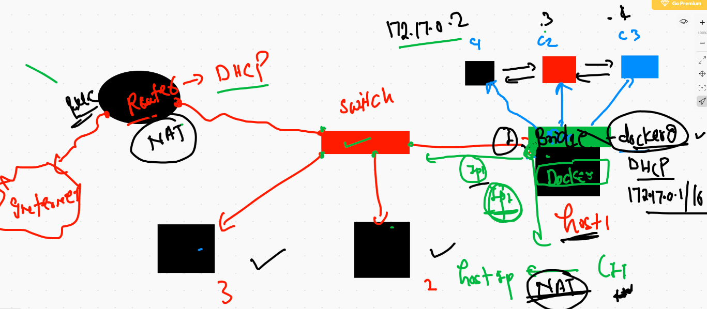

# CRE 

['cri-o'] ('https://cri-o.io/')

['Podman'] ('https://podman.io/')

['RKT'] ('https://coreos.com/rkt/')


# cgroups 

```
5380  docker  run  -d --name x1 alpine ping 127.0.0.1

==
❯ docker top x1
PID                 USER                TIME                COMMAND
476031              root                0:00                ping 127.0.0.1


===
docker stats x1 

CONTAINER ID   NAME      CPU %     MEM USAGE / LIMIT   MEM %     NET I/O     BLOCK I/O   PIDS
9bf0ee6ac274   x1        0.02%     340KiB / 1.942GiB   0.02%     976B / 0B   0B / 0B     1

```

## namespace and cgroups


## Limiting ram in running or creating container 

```
5398  docker  run  --name x2  -d  --memory 100m alpine ping fb.com 
 5399  docker  update x1  --memory 150m  
 5400  docker  update --help
 5401  docker  update x1  --memory-swap 150m  
 5402  docker  update x1  --memory-swap 150m  --memory 100m 

```
## limiting cpu cores

```
❯ docker  run  --name x3  -d  --memory 100m --cpus=1    alpine ping fb.com
e2457005a72f0228b2b691b5fe911a845107afc28bc92cb729415d68e4e6c535
❯ 
❯ docker  run  --name x4  -d  --memory 100m --cpuset-cpus=0 --cpu-shares=20    alpine ping fb.com
4f3e8966a25de65af7423030ff824065b91bba0c31e88efc35d5311d9489c2d9

```

# Building docker image from Git Repo 

```
❯ docker  build  -t  ashujsp:v001  https://github.com/redashu/oraclejavawebappfeb12021.git\#main
Sending build context to Docker daemon   72.7kB
Step 1/7 : FROM tomcat
latest: Pulling from library/tomcat
b9a857cbf04d: Extracting [=====================>                             ]   21.5MB/50.4MB
d557ee20540b: Download complete 
3b9ca4f00c2e: Download complete 
667fd949ed93: Download complete 
b6a945768a17: Download complete 
aa2f45feafbf: Download complete 
7179e0e40c20: Downloading [======================>                            ]  90.56MB/202.8MB
d659cf2d36fd: Download complete 
de2ad1203c1c: Download complete 

```

## deployment of java web app

```
❯ docker run -d --name webapp -p 2233:8080  0b4ecb40fc83
42cb4df252c35dc7881870f3a45daa9481fd8ab022efd50894470e34fe21f2e2
❯ docker  ps
CONTAINER ID   IMAGE          COMMAND             CREATED          STATUS          PORTS                    NAMES
42cb4df252c3   0b4ecb40fc83   "catalina.sh run"   3 seconds ago    Up 2 seconds    0.0.0.0:2233->8080/tcp   webapp

```

# Image sharing 


## Backup & restore 

```
❯ docker  images
REPOSITORY   TAG       IMAGE ID       CREATED          SIZE
ashujsp      v001      0b4ecb40fc83   27 minutes ago   668MB
tomcat       latest    66d886628b2a   6 hours ago      668MB
alpine       latest    e50c909a8df2   4 days ago       5.61MB
❯ 
❯ docker  save  -o  ashuwebapp.tar  ashujsp:v001


=== removing image


❯ docker  rmi  ashujsp:v001
Untagged: ashujsp:v001
Deleted: sha256:0b4ecb40fc832e44a34f533acb325ab8953efaa2664b7219232806d2fc171451
Deleted: sha256:0d9dfdd25ac1b635987ddb0387dae649171d05616c229c91bfee4c44d66f8eb0
Deleted: sha256:ae72d546abe23893c52e136469416504846609bf77745b767ef58c828bc57d26
Deleted: sha256:a92a8548037ea863c3fa7e17afebd4e35ef09973e23428d4d1755f0e79b5f1bb
Deleted: sha256:e96a0eeec63bf3a9a89b1cf0d7b99d69da4d6860ce893ca00c627ff1133db675
Deleted: sha256:091e12f6276c879870c1db185074b1bc1fe058f677bb08a8d58417e4eb9d6168
Deleted: sha256:696acf9199ca2b7e84f977d11b620f273c8859bb2db6311576957ea03b9c2cdf
Deleted: sha256:a23a92a617507dbc150ab1a18874bf844ac06acd97caf9734211cd648cceeab2

```

##  Restore 

```
❯ docker  load -i  ashuwebapp.tar
a22c7f5c03d4: Loading layer [==================================================>]  4.096kB/4.096kB
406cedfa6c3d: Loading layer [==================================================>]  8.192kB/8.192kB
Loaded image: ashujsp:v001
❯ docker  images
REPOSITORY   TAG       IMAGE ID       CREATED          SIZE
ashujsp      v001      0b4ecb40fc83   31 minutes ago   668MB
tomcat       latest    66d886628b2a   7 hours ago      668MB
alpine       latest    e50c909a8df2   4 days ago       5.61MB

```

# Container image registry 


## docker image name explain 


## pusing image to docker hub 

```
docker  tag  ashujsp:v001  dockerashu/ashujsp:v001

docker  login 
docker  push dockerashu/ashujsp:v001 

```

## OCR is almost same as ACR 

['OCR'] ('https://www.oracle.com/webfolder/technetwork/tutorials/obe/oci/registry/index.html')


# Docker networking 


## creating container and checking ip 

```
❯ docker  run  -itd --name x1 alpine ping fb.com
28c5b5b92954a2549daea701199ad6524feea8d69ae862e2c62e2e840b7d0062
❯ docker  ps
CONTAINER ID   IMAGE     COMMAND         CREATED         STATUS         PORTS     NAMES
28c5b5b92954   alpine    "ping fb.com"   6 seconds ago   Up 3 seconds             x1
❯ docker  exec -it  x1 sh
/ # ifconfig 
eth0      Link encap:Ethernet  HWaddr 02:42:AC:11:00:02  
          inet addr:172.17.0.2  Bcast:172.17.255.255  Mask:255.255.0.0
          UP BROADCAST RUNNING MULTICAST  MTU:1500  Metric:1
          RX packets:14 errors:0 dropped:0 overruns:0 frame:0
          TX packets:28 errors:0 dropped:0 overruns:0 carrier:0
          collisions:0 txqueuelen:0 
          RX bytes:1096 (1.0 KiB)  TX bytes:2568 (2.5 KiB)
          
   ```
   
   ## second container 
   
   ```
   ❯ docker  run  -itd --name x2 alpine ping fb.com
f8bdff4386dc802c23dd3f50977a322d514b513725feb3c00932aac1744a99d2
❯ docker  ps
CONTAINER ID   IMAGE     COMMAND         CREATED              STATUS              PORTS     NAMES
f8bdff4386dc   alpine    "ping fb.com"   3 seconds ago        Up 2 seconds                  x2
28c5b5b92954   alpine    "ping fb.com"   About a minute ago   Up About a minute             x1
❯ docker  exec -it  x2 sh
/ # ifconfig 
eth0      Link encap:Ethernet  HWaddr 02:42:AC:11:00:03  
          inet addr:172.17.0.3  Bcast:172.17.255.255  Mask:255.255.0.0
          UP BROADCAST RUNNING MULTICAST  MTU:1500  Metric:1
          RX packets:11 errors:0 dropped:0 overruns:0 frame:0
          TX packets:18 errors:0 dropped:0 overruns:0 carrier:0
          collisions:0 txqueuelen:0 
          RX bytes:846 (846.0 B)  TX bytes:1588 (1.5 KiB)
          
   ```
   
   ## network with NAT 
   
   
   
   ## Docker network bridges 
   
   ```
   ❯ docker  network  ls
NETWORK ID     NAME      DRIVER    SCOPE
11c51a457560   bridge    bridge    local
0cecd29f7ec2   host      host      local
c891d3c2e465   none      null      local
❯ docker  network  inspect  bridge
[
    {
        "Name": "bridge",
        "Id": "11c51a4575605fb0280b3816d223c8a95bf49989931ca797cb28e158a65c5cfd",
        "Created": "2021-01-08T15:48:50.2018942Z",
        "Scope": "local",
        "Driver": "bridge",
        "EnableIPv6": false,
        "IPAM": {
            "Driver": "default",
            "Options": null,
            "Config": [
                {
                    "Subnet": "172.17.0.0/16",
                    "Gateway": "172.17.0.1"
                }
            ]
        },
        "Internal": false,
        "Attachable": false,
        "Ingress": false,
        "ConfigFrom": {
            "Network": ""
        },
        "ConfigOnly": false,
        "Containers": {
            "28c5b5b92954a2549daea701199ad6524feea8d69ae862e2c62e2e840b7d0062": {
                "Name": "x1",
                "EndpointID": "24115b11aef958ec0e40c71d72c0c4f66b134f47811684917869aab8d2b9cce4",
                "MacAddress": "02:42:ac:11:00:02",
                "IPv4Address": "172.17.0.2/16",
                "IPv6Address": ""
            },
            "f8bdff4386dc802c23dd3f50977a322d514b513725feb3c00932aac1744a99d2": {
                "Name": "x2",
                "EndpointID": "de0410e34bc1ccabb9520c2782320bc7ee7aebaf2b45e5a0b855fae3faa0c49a",
                "MacAddress": "02:42:ac:11:00:03",
                "IPv4Address": "172.17.0.3/16",
                "IPv6Address": ""

```
## creating bridges 

```
❯ docker network  ls
NETWORK ID     NAME      DRIVER    SCOPE
11c51a457560   bridge    bridge    local
0cecd29f7ec2   host      host      local
c891d3c2e465   none      null      local
❯ docker network  create ashubr1
a07dfa4e4534cec9a1ffbede30b8a1300dc68095083ff5cf5f7fa8fa31dbc089
❯ docker network  ls
NETWORK ID     NAME      DRIVER    SCOPE
a07dfa4e4534   ashubr1   bridge    local
11c51a457560   bridge    bridge    local
0cecd29f7ec2   host      host      local
c891d3c2e465   none      null      local
❯ docker network  create ashubr2  --subnet 192.168.0.0/16
96a792e26dcb650b93343695783f5cf0ea15c41763077e2d86f0fc36fb50cac7
❯ docker network ls
NETWORK ID     NAME      DRIVER    SCOPE
a07dfa4e4534   ashubr1   bridge    local
96a792e26dcb   ashubr2   bridge    local
11c51a457560   bridge    bridge    local
0cecd29f7ec2   host      host      local
c891d3c2e465   none      null      local


```

## bridge container 

```
5505  docker network  create ashubr1 
 5506  docker network  ls
 5507  docker network  create ashubr2  --subnet 192.168.0.0/16  
 5508  docker network ls
 5509  history
 5510  docker network inspect ashubr1
 5511  docker network  ls
 5512  docker network  inspect ashubr2
 5513  history
 5514  docker run -d --name x3 --network ashubr1 alpine ping fb.com 
 5515  docker run -d --name x4 --network ashubr2 alpine ping fb.com 
 5516  docker  ps
 5517  docker run -d --name x5 --network ashubr2  --ip 192.168.0.100   alpine ping fb.com 
 
 ```
 
 ## changing ip of a running container 
 
 ```
 docker run -it --rm --privileged alpine
/ # ifconfig eth0 172.17.0.100
/ # ifconfig eth0
eth0      Link encap:Ethernet  HWaddr 02:42:AC:11:00:02  
          inet addr:172.17.0.100  Bcast:172.17.255.255  Mask:255.255.0.0
          UP BROADCAST RUNNING MULTICAST  MTU:1500  Metric:1
          RX packets:9 errors:0 dropped:0 overruns:0 frame:0
          TX packets:0 errors:0 dropped:0 overruns:0 carrier:0
          collisions:0 txqueuelen:0 
          RX bytes:766 (766.0 B)  TX bytes:0 (0.0 B)
          
          
   ```
   
  ## Question 2 
  
  ```
  Q2.  create container from centos latest image and do the below things 

In this container create a file called  hello.txt with data “hii docker” using vim editor
Check ip address of the container and write that ip in hello.txt 
Ip address must be checked from inside the container only 

  ```
  
## Question 3

```
Q3.  build a docker image  and push it to docker hub 

Use this url “https://github.com/mdn/beginner-html-site-styled” (USE THIS LINK inside dockerfile only)
Create a dockerfile by the name  <yourname>.dockerfile
Use any image in FROM statement but you need to install httpd server 
Copy above html based application into the document root of httpd server 
Use ENTRYPOINT to define parent process so that whenever container go created this must host this application by default.
Name of image during build time will be  <yourname>apache:httpd2
Create a container to verify everything is working fine then delete container
If application is working fine then only push this image to docker hub

```
